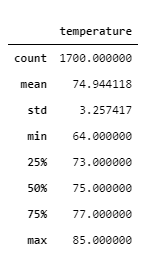
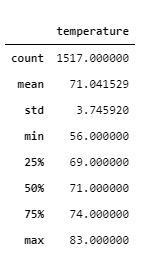
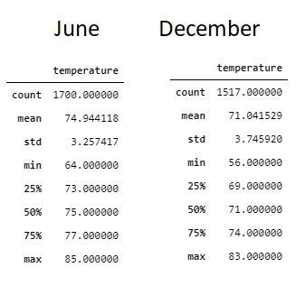
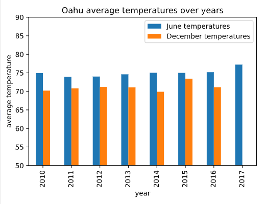
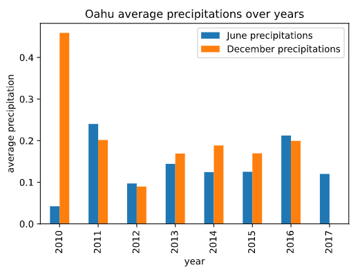

# surfs_up
Weather analysis with sqllite
# Overview
To further assist W. Avy with the weather analysis, we create descriptive statistics on temperature data for the months of June and December in Oahu.<br> 
This will allow us to determine if the surf and ice cream shop business is sustainable year-round.

# Results
To perform our analysis we do the following steps:<br>
1- Create an engine to our database<br>
`engine = create_engine("sqlite:///hawaii.sqlite")`<br>
2- Reflect an existing database into a new model<br>
`Base = automap_base()`<br>
3- Reflect the tables<br>
`Base.prepare(engine, reflect=True)`<br>
3- Create references to each table<br>
```
Measurement = Base.classes.measurement
Station = Base.classes.station
```
4- Create our session (link) from Python to the DB<br>
`session = Session(engine)`<br>

5- Query the database for the temperatures in the month of June and December<br>
`june = session.query(Measurement.date,Measurement.tobs).filter(extract('month', Measurement.date) == 6)`<br>
`december = session.query(Measurement.date,Measurement.tobs).filter(extract('month', Measurement.date) == 12)`<br>

6- Convert the results into list<br>
```
june = june.all()
december = december.all()
```
7- Create pandas dataframe on each list<br>
```
juneDF = pd.DataFrame(june, columns=['date','temperature'])
decemberDF = pd.DataFrame(december, columns=['date','temperature'])
```
8- Gather descriptive stats on each dataframe<br>
`juneDF.describe()`<br>:
<br>
`decemberDF.describe()`<br>
<br>


# Summary
The comparison between temperatures for the months of June and December show little variance<br>
<br>

We also analyzed the average temperature and precipitations over the years<br>
`SurfsUp_AdditionalAnalysis.ipynb`<br>

<br>
We notice minor temperature difference between June and December with average temperatures over 70<br>

<br>
We notice that apart from year 2010 the average precipations do not change much between June and December

### In conclusion we can say that Oahu is a suitable location for a sustainable surf and ice cream shop business year-round.
